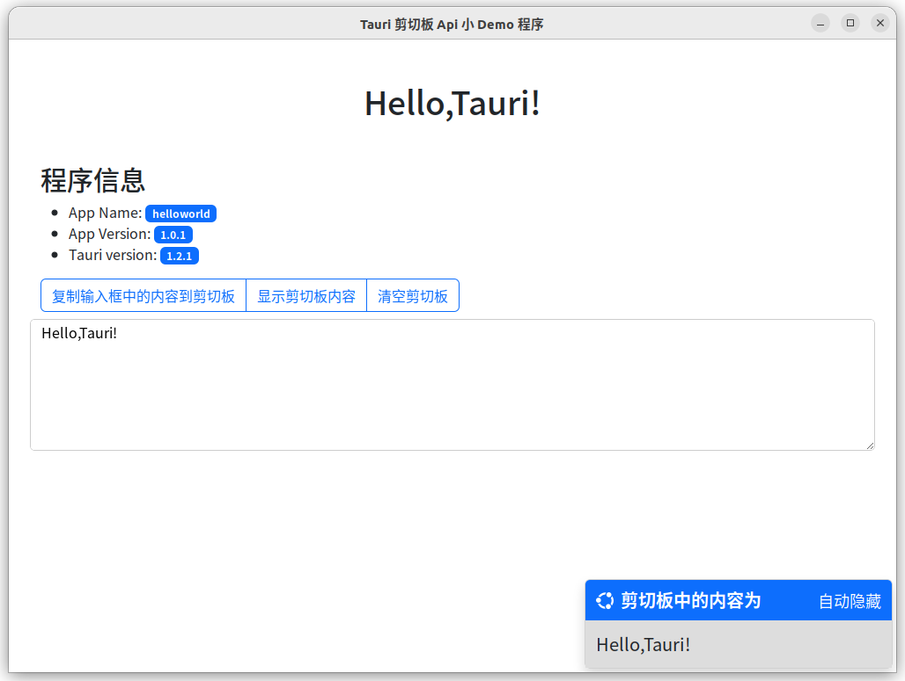

## 项目介绍

该项目是我写的一个 `Tauri` 剪切板 `Api` 例子程序，适合刚接触 `Tauri`的朋友作为学习参考。

## 项目所用框架

- **Vue + Vite**
- **Bootstrap**
- **Bootstrap-icons**

## 程序界面



## 运行项目
进入项目根目录后运行一下命令：
```shell
$ pnpm install # 安装依赖
$ pnpm tauri dev # 启动开发环境，并启动程序界面
```

